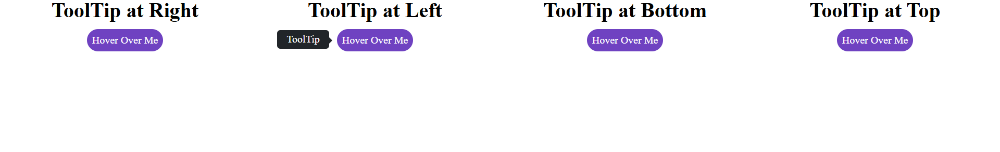

# 🧭 Responsive Tooltip Component (Pure HTML + CSS)

A clean and responsive **tooltip component** built using only **HTML** and **CSS**.  
It displays tooltips in four directions — **top**, **bottom**, **left**, and **right** — on hover, with custom arrow indicators and smooth layout.

---

## 🎨 Features

- 📌 Tooltips appear on hover in **4 directions** (top, right, bottom, left)
- 💬 Smooth tooltip appearance with arrow pointers
- 🎨 Fully customizable with pure **CSS**
- ⚙️ No JavaScript or external libraries required
- 📱 Responsive layout using CSS Grid

---

## 🛠️ Built With

| Technology | Purpose          |
| ---------- | ---------------- |
| 🧱 HTML5   | Structure        |
| 🎨 CSS3    | Styling & Layout |

---

## 📸 Screenshot

---

## 🌐 Live Demo

🔗 **GitHub Pages:**

[https://gauravjlad.github.io/Responsive-Tooltip](https://gauravjlad.github.io/Responsive-Tooltip)

---

## 📧 Let’s Connect

🔗 **LinkedIn:**  
[https://www.linkedin.com/in/gaurav-lad1974](https://www.linkedin.com/in/gaurav-lad1974)

📨 **Email:**  
gauravlad1974@gmail.com
